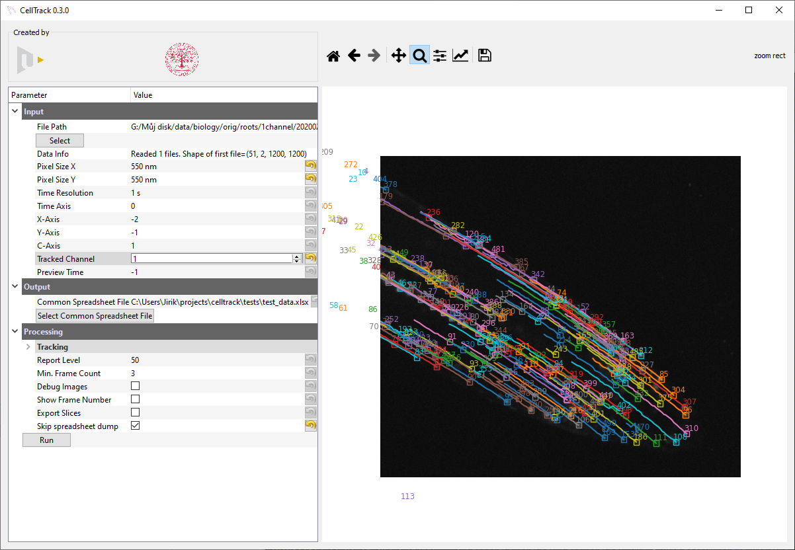

# CellTrack
Tracking of roots in microscopy images.

Check [changelog](changelog.md) to see what is new.

# Install 

1. [Install Conda](https://conda.io/miniconda.html) (for Python 3, 64-bit) and  check "Add Anaconda to my PATH environment variable" 
**during the installation**

2. Use terminal to install required packages
```bash
conda create -n celltrack -c mjirik -c conda-forge celltrack pywin32
conda activate celltrack
python -m celltrack install
python -m celltrack
```

The `pywin32` is used for icon installation. It can be skipped.

## For developpers

Clone the repo
```cmd
git clone git@github.com:mjirik/celltrack.git
```

# Run

```cmd
cd celltrack
python -m celltrack
```

# GUI



# Uninstall 

1. Use terminal to remove celltrack environment

```
conda remove --name celltrack --all
```

2. Manually remove icon from your desktop

3. You can uninstall Conda by deleting conda directory in your home dir