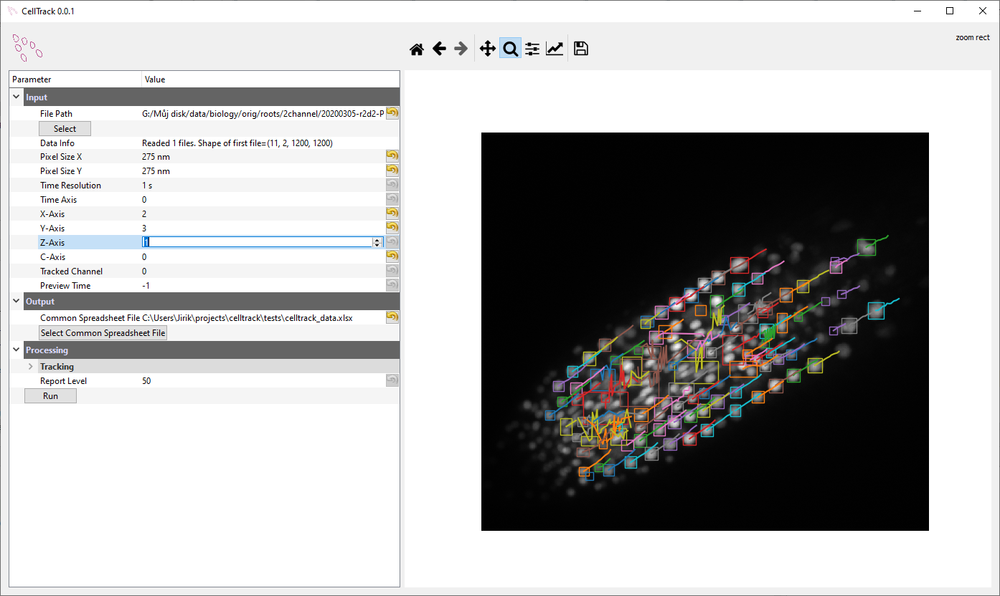

# CellTrack
Tracking of roots in brightfield microscope


# Install 

You can use [anaconda distribution](https://docs.conda.io/en/latest/miniconda.html)
for easy installation 

```bash
conda create -n celltrack -c mjirik -c conda-forge celltrack pywin32
conda activate celltrack
python -m celltrack install
python -m celltrack
```

The `pywin32` is used for icon installation. It can be skipped.

Clone the repo
```cmd
git clone git@github.com:mjirik/celltrack.git
```

Run

```cmd
cd celltrack
python -m celltrack
```

# GUI

