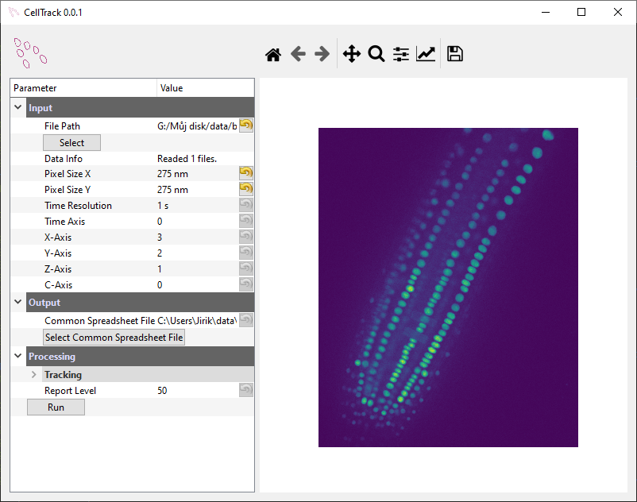

# rootrack
Tracking of roots in brightfield microscope


# Install 

You can use [anaconda distribution](https://docs.conda.io/en/latest/miniconda.html)
for easy installation 


```bash
conda install -c mjirik -c conda-forge -c bioconda scaffan python=3.6 exsu
scikit-learn
```

Clone the repo

```cmd
git clone git@github.com:mjirik/rootrack.git
```

Run

```cmd
cd rootrack
python -m rootrack
```

# GUI

